# Flutter Mobile App for FitnessBlitz

Project aim: Develop a fitness club mobile app with virtual authorization, training plan calendar, coach chat, BMI calculator, and online payments. The app stores data in a database accessible to managers and receptionists. User info auto-fills after registration. Receptionists/managers help customers select coaches, creating a live, relational database for easier management.

## System Design

**Objectives of the system**
1.	Create login/registration pages and online registration process possible
2.	Create page to make it possible for a user to edit his/her personal information
3.	Modern UI/UX design, adaptive for different display sizes and resolutions
4.	Create a database for clients, coaches and memberships in phpMyAdmin
5.	Create a virtual authorization card with a unique EAN-13 barcode for every client
6.	Make a direct chat between customer and coach in the app
7.	Add an editable calendar for a training plan with a date search
8.	Add an BMI calculator to the app functionality
9.	Create an online payment section

**Data-Flow Diagram**

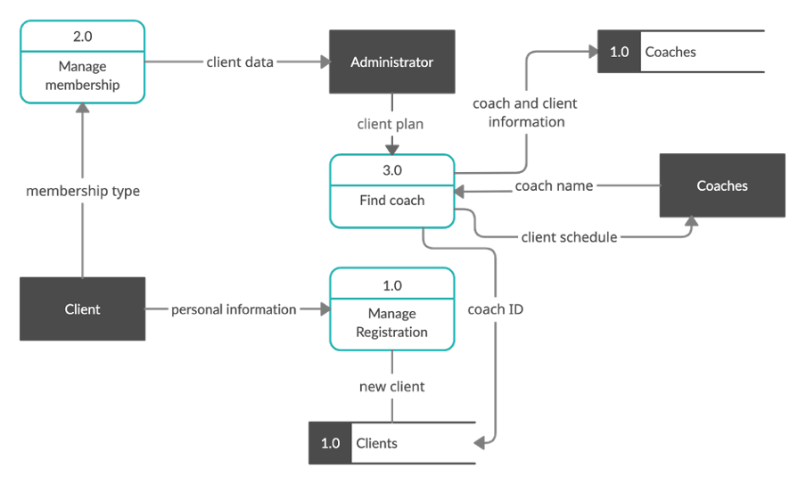

The client submits a form with personal information, this automatically goes through registration management to the client’s database. Data about the chosen membership type goes through membership management directly to the administrator, which in turn, creates a request for a coach via coach management. After the coach is detected, client data goes to the coach’s database and the coach ID is now added to the client record in the client database.

**Flowchart Diagram**

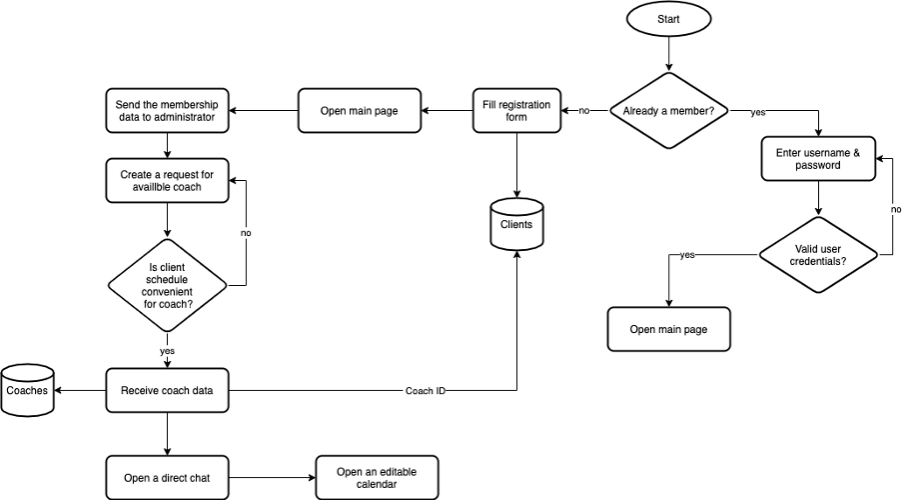

Firstly, the app checks if a user is already a member or not. If a user is already a member, the usual authentication process runs. The program requires entering of the username and the password, then checks if it is valid or not. If it is okay, then the main page is loaded with access to the chat and calendar. However, if the user isn’t a member, the registration form opens. User submits a form with personal data, then all data will be saved in the database, opens the main page, and part of the data goes to the administrator. Administrator creates a request for the coach. When a coach is found, coach database updates (new client info added), direct chat between coach and client open for both, calendar becomes available.

**Entity Relationship Diagram**

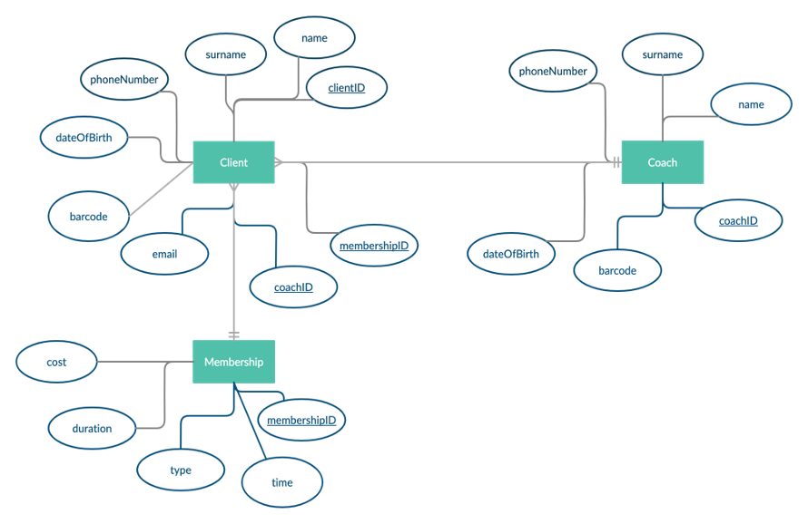

**Database Structure**

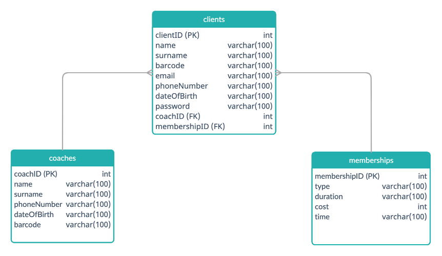

**Intended benefits:**
1.	Actual data in a database with all clients, coaches and available membership types
2.	Registration process can be done online
3.	User data can be edited in the mobile app (excluding barcode, email and password)
4.	Plastic authentication cards are replaced by virtual ones
5.	Payment for a membership can be done via online payment methods (Kaspi.kz)
6.	Direct chat with coach available, no need to use additional apps/messengers to communicate with a coach
7.	Unique design, similar to fitness club’s logo design
8.	Database has relations between table, this makes management processes much more convenient for an administrator
9.	Online calendar with date search algorithm
10.	Body mass index calculator in the app

## Development

**1. Login and Registration pages**

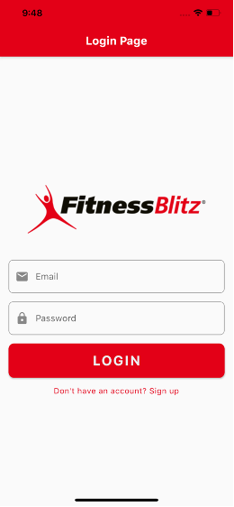 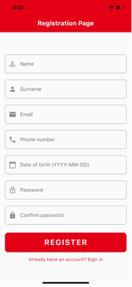

**2. Dashboard and Profile pages**

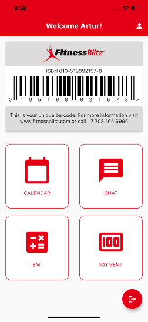 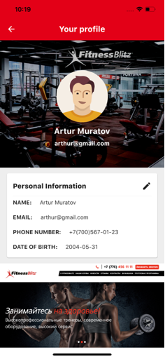

Dashboard page provides a user with a unique barcode. From this page users can access their profile page (by clicking the person icon at the app bar), calendar page, chat with a coach, BMI calculator and online payment section. Users can also logout from their account by clicking the exit button. The logout process is accomplished by `logout.php` file. Design of the page is written in the `dashBoard.dart` file. Profile page displays user’s personal information and fitness club’s news at the bottom of the page. Personal information page can be edited by clicking the pen icon. Code for the profile page is written in `profile.dart` file.

**3. Calendar and Chat pages**

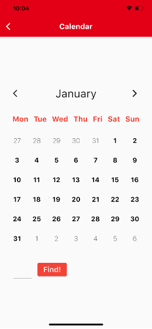 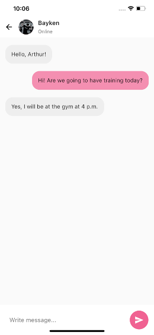

Code for the calendar page is written in the `calendar.dart` file. For the search of the date the program uses the binary search algorithm, which is also located in the `calendar.dart` file. Calendar uses binary search to find a number from the array or dates of the calendar; the searched date is then highlighted with a green color. Code for the chat page is written in the `chat.dart` file. 

**4. BMI Calculator page**

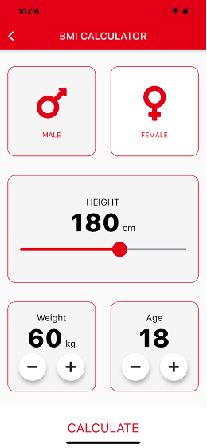 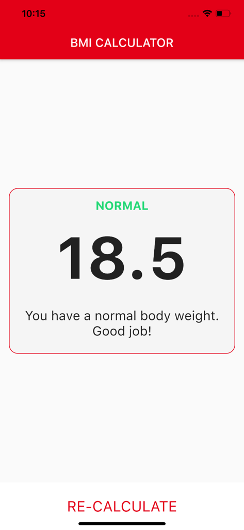

Code for the design of the BMI calculator is written in the `bmi.dart` file, while all the calculations are done in the `calculator_brain.dart` file. Code for the BMI calculator result page is also written in the `bmi.dart` file and has 3 options to be displayed: Overweight, Normal and Underweight.

**5. Online Payment page**

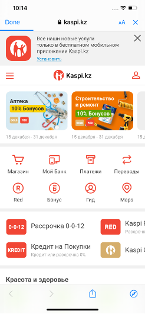

Payment section provides a redirection to the kaspi.kz online payment service.

## Installation

**Step 1: Install Flutter**

To install Flutter, follow the instructions in the [official documentation](https://docs.flutter.dev/get-started/install).

**Step 2: Clone the Repository**

Clone this repository using Git or download it as a ZIP file and extract it.
```
git clone https://github.com/your-username/your-project.git
```

**Step 3: Install Dependencies**
Open the terminal or command prompt, navigate to the project directory and run the following command to install the required dependencies:
```
flutter pub get
```

**Step 4: Run the App**
Connect an Android or iOS device to your computer and run the following command to start the app:
```
flutter run
```
Alternatively, you can run the app on a virtual device by opening the Android or iOS emulator and then running the same command.

That's it! You should now be able to see the app running on your device or emulator. Happy coding!
